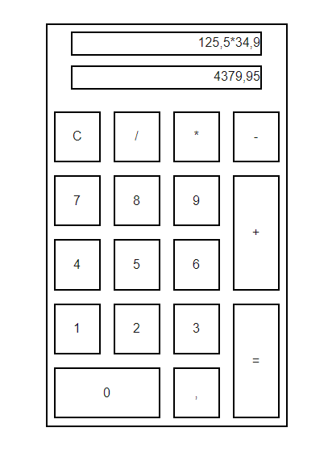
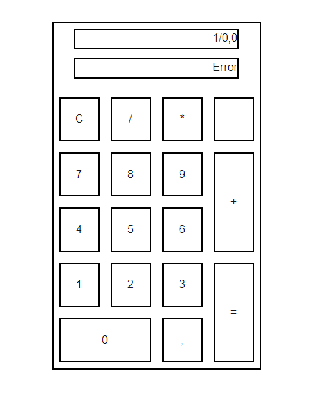
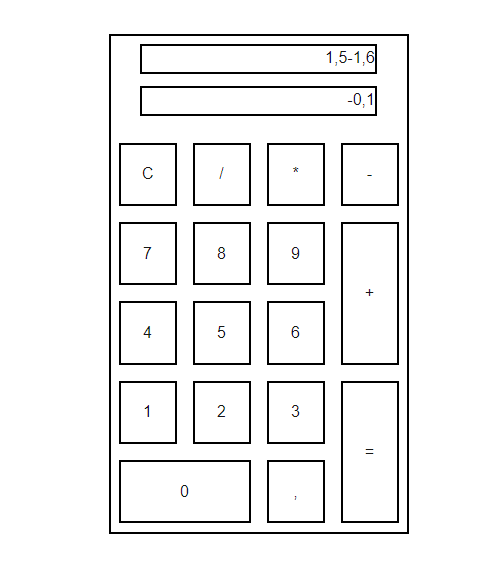

## Calculator App

This is a simple calculator application built with React, designed to handle basic arithmetic operations. The app includes a user-friendly interface and allows for addition, subtraction, multiplication, division, and decimal calculations.

### Features

- Basic Operations: Supports addition, subtraction, multiplication, and division.
- Decimal Point: Allows for decimal calculations.
- Responsive Design: Works well on various screen sizes.
- Error Handling: Proper error messages are shown for invalid operations like division by zero.

### Usage

1. Input numbers and operators using the calculator buttons.
2. To perform a calculation, press the equals (=) button.
3. To clear all input, press the C button.

### Screenshots

